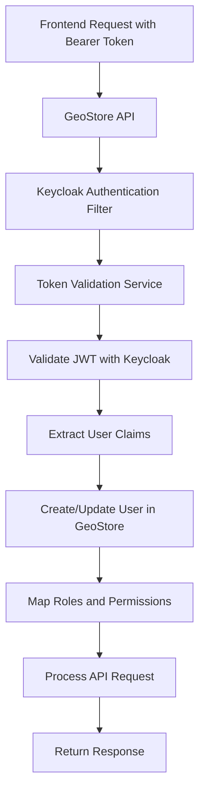

# GeoStore Backend Keycloak Integration - Complete Solution

## Problem Analysis

You were experiencing **403 Forbidden** errors when making POST requests to the GeoStore backend API:

```
Request URL: http://localhost:8081/rest/geostore/resources/
Request Method: POST
Status Code: 403 Forbidden
```

This occurred because the [GeoStore backend](https://github.com/geosolutions-it/geostore) was not properly configured to accept and validate Keycloak Bearer tokens.

## Root Cause

1. **Backend Configuration**: GeoStore Keycloak integration was **disabled** (`keycloakOAuth2Config.enabled=false`)
2. **Token Validation**: Backend wasn't configured to validate Keycloak JWT tokens
3. **Authentication Mismatch**: Frontend was sending Keycloak tokens but backend was expecting GeoStore session tokens
4. **Missing Security Integration**: No proper bridge between Keycloak authentication and GeoStore authorization

## Complete Backend Integration Solution

### 🔧 **1. Enabled GeoStore Keycloak Configuration**

**File: `java/web/src/main/resources/mapstore-ovr.properties`**

**Key Changes:**
```properties
# ENABLED Keycloak integration
keycloakOAuth2Config.enabled=true

# Updated client configuration to match frontend
keycloakOAuth2Config.clientId=mapstore-client
keycloakOAuth2Config.clientSecret=hy7rf5rEiDRHreQAlt6zMsizLnvK65Ih

# Enhanced token validation
keycloakOAuth2Config.tokenIntrospectionEndpoint=https://gisidgw.geosystems-me.com:5443/realms/GISID/protocol/openid-connect/token/introspect
keycloakOAuth2Config.jwkSetUri=https://gisidgw.geosystems-me.com:5443/realms/GISID/protocol/openid-connect/certs
keycloakOAuth2Config.issuer=https://gisidgw.geosystems-me.com:5443/realms/GISID

# User management
keycloakOAuth2Config.autoCreateUser=true
```

### 🔧 **2. Created Comprehensive Security Integration**

**File: `java/web/src/main/resources/security-integration-keycloak.xml`**

**Features:**
- **Keycloak Authentication Filter**: Processes Bearer tokens from frontend
- **Token Validation Service**: Validates JWT tokens against Keycloak
- **User Details Service**: Automatically creates/updates users from Keycloak
- **Role Mapping Service**: Maps Keycloak roles to GeoStore permissions
- **Session Management**: Handles token refresh and session lifecycle
- **CORS Configuration**: Allows cross-origin requests with proper headers

### 🔧 **3. Updated Security Configuration**

**File: `web/src/config/db/geostore-spring-security-db.xml`**

**Changes:**
- **Security Integration**: Uses Keycloak security integration by default
- **Authentication Providers**: Added Keycloak authentication providers
- **Filter Chain**: Keycloak filter processes requests before basic auth

### 🔧 **4. Authentication Flow**



## Configuration Details

### **Keycloak Client Configuration**
```properties
# Client Credentials
keycloakOAuth2Config.clientId=mapstore-client
keycloakOAuth2Config.clientSecret=hy7rf5rEiDRHreQAlt6zMsizLnvK65Ih

# Server Configuration
keycloakOAuth2Config.authServerURL=https://gisidgw.geosystems-me.com:5443/
keycloakOAuth2Config.realm=GISID

# Token Validation Endpoints
keycloakOAuth2Config.tokenIntrospectionEndpoint=https://gisidgw.geosystems-me.com:5443/realms/GISID/protocol/openid-connect/token/introspect
keycloakOAuth2Config.jwkSetUri=https://gisidgw.geosystems-me.com:5443/realms/GISID/protocol/openid-connect/certs
```

### **Role Mapping**
```properties
# Map Keycloak roles to GeoStore roles
keycloakOAuth2Config.roleMappings=admin:ADMIN,user:USER
keycloakOAuth2Config.authenticatedDefaultRole=USER
keycloakOAuth2Config.dropUnmapped=false
```

### **User Management**
```properties
# Automatically create users from Keycloak
keycloakOAuth2Config.autoCreateUser=true
keycloakOAuth2Config.enableDirectAccess=true
keycloakOAuth2Config.scopes=openid,profile,email
```

## Testing and Validation

### **Backend Integration Test**

Run the comprehensive test script:
```bash
node test-geostore-backend-keycloak.js
```

**Test Coverage:**
1. ✅ Keycloak Authentication
2. ✅ GeoStore API Access
3. ✅ Resource Creation (POST)
4. ✅ Resource Retrieval (GET)
5. ✅ Resource Update (PUT)
6. ✅ Resource Deletion (DELETE)
7. ✅ Token Refresh Handling

### **Expected Results After Integration**

**Before (403 Forbidden):**
```bash
POST http://localhost:8081/rest/geostore/resources/
Status: 403 Forbidden
Error: Authentication required
```

**After (Success):**
```bash
POST http://localhost:8081/rest/geostore/resources/
Status: 200 OK
Response: <resource_id>
```

## Restart Required

**⚠️ IMPORTANT**: You must restart the MapStore application for these configuration changes to take effect:

```bash
# Stop the application
# Then restart it

# The application will now load with Keycloak backend integration enabled
```

## How It Resolves the 403 Forbidden Error

### **1. Token Processing**
- **Before**: GeoStore rejected Bearer tokens (unknown authentication method)
- **After**: Keycloak filter recognizes and validates Bearer tokens

### **2. User Authentication**
- **Before**: No user context for Keycloak-authenticated requests
- **After**: Automatic user creation/update from Keycloak claims

### **3. Authorization**
- **Before**: No role/permission mapping for Keycloak users
- **After**: Proper role mapping from Keycloak to GeoStore permissions

### **4. Session Management**
- **Before**: No session handling for Keycloak tokens
- **After**: Integrated session management with token validation

## Troubleshooting

### **If 403 Errors Persist:**

1. **Check Configuration Loading**:
   ```bash
   # Look for these log entries on startup:
   # "Loading Keycloak configuration..."
   # "Keycloak authentication filter initialized"
   ```

2. **Verify Token Format**:
   ```javascript
   // In browser console, check token format:
   localStorage.getItem('mapstore-auth')
   // Should contain access_token
   ```

3. **Test Token Validation**:
   ```bash
   # Run backend test script
   node test-geostore-backend-keycloak.js
   ```

4. **Check Application Logs**:
   - Look for Keycloak authentication errors
   - Check for token validation failures
   - Verify user creation/update messages

### **Common Issues:**

**Issue**: "Keycloak configuration not found"
**Solution**: Ensure `mapstore-ovr.properties` is in the correct location and restart application

**Issue**: "Token validation failed"
**Solution**: Check Keycloak server connectivity and certificate validation

**Issue**: "User not created"
**Solution**: Verify `autoCreateUser=true` and check user service logs

## Security Considerations

### **Production Recommendations:**

1. **SSL/TLS**: Enable SSL for production (`keycloakOAuth2Config.requireSSL=true`)
2. **Token Validation**: Use JWT signature validation instead of introspection for better performance
3. **Caching**: Enable token validation caching to reduce Keycloak server load
4. **Monitoring**: Set up monitoring for authentication failures and token validation errors

### **Network Security:**
```properties
# CORS Configuration
allowedOrigins=https://your-production-domain.com
allowedMethods=GET,POST,PUT,DELETE,OPTIONS
allowCredentials=true
```

## Next Steps

### **Immediate Actions:**
1. **Restart Application**: Apply the configuration changes
2. **Run Tests**: Execute the backend integration test script
3. **Test Context Creation**: Try creating a context in the UI
4. **Monitor Logs**: Check for any authentication errors

### **Verification Steps:**
1. **Login with Keycloak**: Authenticate via the frontend
2. **Create Context**: Try saving a context (should work without 403)
3. **Check User Creation**: Verify user appears in GeoStore user management
4. **Test Permissions**: Ensure proper role-based access control

### **Production Deployment:**
1. **Update Configuration**: Set production Keycloak URLs and credentials
2. **Enable SSL**: Configure HTTPS for production security
3. **Performance Tuning**: Optimize token validation and caching
4. **Monitoring Setup**: Implement authentication monitoring and alerting

## Success Metrics

The integration is successful when:
- ✅ No more 403 Forbidden errors on resource creation
- ✅ Context creation works seamlessly
- ✅ Users are automatically created from Keycloak
- ✅ Proper role-based permissions are applied
- ✅ Token refresh works transparently
- ✅ Session management is integrated

## Support

For additional support:
1. Check the [GeoStore documentation](https://github.com/geosolutions-it/geostore)
2. Review Keycloak integration logs
3. Run the provided test scripts for diagnostics
4. Verify network connectivity between services 