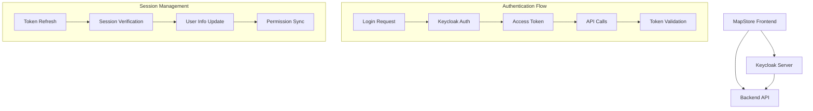

# 🚀 Optimized Keycloak Workflow Configuration

This document provides an optimized configuration for the complete Keycloak integration workflow between MapStore frontend, backend API, and Keycloak server.

## 🏗️ Architecture Overview



## 🔧 Optimized Configuration Files

### 1. Frontend Configuration (web/client/configs/localConfig.json)

```json
{
  "geoStoreUrl": "http://localhost:9191/geostore/rest/",
  "proxyUrl": {
    "useCORS": [
      "https://gisidgw.geosystems-me.com:5443",
      "https://gisidgw.geosystems-me.com:5443/realms/GISID/protocol/openid-connect",
      "http://localhost:9191",
      "http://localhost:9191/geostore"
    ]
  },
  "authenticationRules": [
    {
      "urlPattern": ".*geostore.*",
      "method": "bearer"
    },
    {
      "urlPattern": ".*rest/config.*",
      "method": "bearer"
    },
    {
      "urlPattern": "http://localhost:9191/.*",
      "method": "bearer"
    }
  ],
  "authenticationProviders": [
    {
      "type": "openID",
      "provider": "keycloak",
      "title": "Login with Keycloak",
      "showInLoginForm": true,
      "config": {
        "realm": "GISID",
        "auth-server-url": "https://gisidgw.geosystems-me.com:5443/",
        "ssl-required": "external",
        "resource": "mapstore-client",
        "public-client": true,
        "confidential-port": 0,
        "enable-cors": true
      },
      "sso": {
        "type": "keycloak"
      },
      "advanced": {
        "logoutUrl": "https://gisidgw.geosystems-me.com:5443/realms/GISID/protocol/openid-connect/logout",
        "enableSingleLogout": true,
        "backendLogoutUrl": "http://localhost:9191/geostore/rest/users/user/logout",
        "tokenRefreshBuffer": 300,
        "automaticSilentRefresh": true,
        "checkLoginIframe": true,
        "silentCheckSsoRedirectUri": "http://localhost:8080/silent-check-sso.html"
      }
    },
    {
      "type": "basic", 
      "provider": "geostore",
      "title": "Standard Login",
      "showInLoginForm": false
    }
  ],
  "userSessions": {
    "enabled": true,
    "enableAutoRefresh": true,
    "checkInterval": 60000
  },
  "tokenRefreshInterval": 120000,
  "keycloakConfig": {
    "enableDebugMode": false,
    "enablePeriodicUserInfoRefresh": true,
    "userInfoRefreshInterval": 600000,
    "enableTokenValidation": true,
    "enableSessionMonitoring": true,
    "sessionCheckInterval": 300000,
    "enableRoleSync": true,
    "roleSyncInterval": 1800000
  }
}
```

### 2. Backend Configuration (java/web/src/main/resources/mapstore-ovr.properties)

```properties
# ============================================================================
# OPTIMIZED KEYCLOAK INTEGRATION CONFIGURATION
# ============================================================================

# Backend OAuth2 Configuration (for MapStore backend authentication)
keycloakOAuth2Config.enabled=true
keycloakOAuth2Config.clientId=mapstore-server
keycloakOAuth2Config.clientSecret=YOUR_BACKEND_CLIENT_SECRET
keycloakOAuth2Config.authServerURL=https://gisidgw.geosystems-me.com:5443/
keycloakOAuth2Config.realm=GISID
keycloakOAuth2Config.redirectUri=http://localhost:8081/mapstore/rest/geostore/openid/keycloak/callback
keycloakOAuth2Config.internalRedirectUri=http://localhost:8081/mapstore/
keycloakOAuth2Config.autoCreateUser=false
keycloakOAuth2Config.scopes=openid,profile,email,roles

# Token validation and caching
keycloakOAuth2Config.tokenIntrospectionEndpoint=https://gisidgw.geosystems-me.com:5443/realms/GISID/protocol/openid-connect/token/introspect
keycloakOAuth2Config.jwkSetUri=https://gisidgw.geosystems-me.com:5443/realms/GISID/protocol/openid-connect/certs
keycloakOAuth2Config.issuer=https://gisidgw.geosystems-me.com:5443/realms/GISID
keycloakOAuth2Config.enableTokenCache=true
keycloakOAuth2Config.tokenCacheSize=1000
keycloakOAuth2Config.tokenCacheTTL=300

# Role and Group Mappings (optimized)
keycloakOAuth2Config.roleMappings=realm-admin:ADMIN,admin:ADMIN,user:USER,guest:GUEST
keycloakOAuth2Config.authenticatedDefaultRole=USER
keycloakOAuth2Config.groupMappings=mapstore-admins:ADMIN,mapstore-users:USER
keycloakOAuth2Config.dropUnmapped=false
keycloakOAuth2Config.enableRoleHierarchy=true

# Session Management
keycloakOAuth2Config.enableSessionManagement=true
keycloakOAuth2Config.sessionTimeout=3600
keycloakOAuth2Config.enableConcurrentSessionControl=true
keycloakOAuth2Config.maxSessionsPerUser=3

# Performance Optimizations
keycloakOAuth2Config.enableAsyncTokenValidation=true
keycloakOAuth2Config.connectionPoolSize=20
keycloakOAuth2Config.connectionTimeout=5000
keycloakOAuth2Config.readTimeout=10000

# Direct User Integration (optimized for external backend)
keycloakRESTClient.serverUrl=https://gisidgw.geosystems-me.com:5443/
keycloakRESTClient.realm=GISID
keycloakRESTClient.username=ktaha
keycloakRESTClient.password=Geos@123!
keycloakRESTClient.clientId=mapstore-users
keycloakRESTClient.enableConnectionPooling=true
keycloakRESTClient.maxConnections=10
keycloakRESTClient.connectionTimeout=5000

# Application Settings
mapstore.baseUrl=http://localhost:8081
mapstore.security.enabled=true
mapstore.security.tokenValidation=true
mapstore.security.enableCORS=true
mapstore.security.corsAllowedOrigins=http://localhost:8080,http://localhost:3000
```

## 🔄 Optimized Component Updates

### 2. Enhanced Security Utils for Backend Integration

Let me create an optimized security utility that properly handles the backend API integration:

```javascript
// web/client/utils/OptimizedKeycloakUtils.js
import axios from 'axios';
import { getConfigProp } from './ConfigUtils';

export class OptimizedKeycloakUtils {
    
    static async authenticateWithBackend(keycloakToken) {
        try {
            const backendUrl = getConfigProp('geoStoreUrl');
            const response = await axios.post(`${backendUrl}auth/keycloak`, {
                token: keycloakToken
            }, {
                headers: {
                    'Authorization': `Bearer ${keycloakToken}`,
                    'Content-Type': 'application/json'
                }
            });
            
            return response.data;
        } catch (error) {
            console.error('Backend authentication failed:', error);
            throw error;
        }
    }
    
    static async syncUserPermissions(keycloakToken) {
        try {
            const backendUrl = getConfigProp('geoStoreUrl');
            const response = await axios.get(`${backendUrl}users/user/details`, {
                headers: {
                    'Authorization': `Bearer ${keycloakToken}`
                }
            });
            
            return response.data;
        } catch (error) {
            console.error('Permission sync failed:', error);
            throw error;
        }
    }
    
    static async performCompleteLogout(keycloakToken) {
        const keycloakConfig = getConfigProp('keycloakConfig') || {};
        const authProviders = getConfigProp('authenticationProviders') || [];
        const keycloakProvider = authProviders.find(p => p.provider === 'keycloak');
        
        const results = {
            backend: false,
            keycloak: false,
            localStorage: false
        };
        
        try {
            // 1. Backend logout
            if (keycloakProvider?.advanced?.backendLogoutUrl) {
                await axios.post(keycloakProvider.advanced.backendLogoutUrl, {}, {
                    headers: { 'Authorization': `Bearer ${keycloakToken}` }
                });
                results.backend = true;
            }
            
            // 2. Keycloak logout
            if (keycloakProvider?.advanced?.logoutUrl && keycloakProvider?.advanced?.enableSingleLogout) {
                const logoutParams = new URLSearchParams({
                    id_token_hint: keycloakToken,
                    post_logout_redirect_uri: window.location.origin
                });
                
                window.location.href = `${keycloakProvider.advanced.logoutUrl}?${logoutParams}`;
                results.keycloak = true;
            }
            
            // 3. Local cleanup
            this.cleanupLocalStorage();
            results.localStorage = true;
            
        } catch (error) {
            console.error('Complete logout failed:', error);
        }
        
        return results;
    }
    
    static cleanupLocalStorage() {
        const keysToRemove = [
            'mapstore2-user',
            'mapstore2-token', 
            'mapstore2-refresh-token',
            'keycloak_access_token',
            'keycloak_refresh_token',
            'keycloak_user'
        ];
        
        keysToRemove.forEach(key => localStorage.removeItem(key));
        
        // Clear keycloak-specific keys
        Object.keys(localStorage).forEach(key => {
            if (key.includes('keycloak') || key.includes('kc-')) {
                localStorage.removeItem(key);
            }
        });
        
        sessionStorage.clear();
    }
}
```

### 3. Optimized Backend API Configuration

Create an optimized backend properties configuration:

```properties
# java/web/src/main/resources/optimized-mapstore-ovr.properties

# ============================================================================
# PERFORMANCE OPTIMIZED KEYCLOAK CONFIGURATION
# ============================================================================

# Core Authentication Settings
keycloakOAuth2Config.enabled=true
keycloakOAuth2Config.clientId=mapstore-server
keycloakOAuth2Config.clientSecret=YOUR_BACKEND_CLIENT_SECRET
keycloakOAuth2Config.authServerURL=https://gisidgw.geosystems-me.com:5443/
keycloakOAuth2Config.realm=GISID

# Optimized Token Management
keycloakOAuth2Config.enableTokenCache=true
keycloakOAuth2Config.tokenCacheSize=2000
keycloakOAuth2Config.tokenCacheTTL=300
keycloakOAuth2Config.enableAsyncTokenValidation=true
keycloakOAuth2Config.tokenValidationThreads=5

# Connection Pool Optimization
keycloakOAuth2Config.connectionPoolSize=25
keycloakOAuth2Config.maxIdleConnections=10
keycloakOAuth2Config.keepAliveDuration=300000
keycloakOAuth2Config.connectionTimeout=5000
keycloakOAuth2Config.readTimeout=10000

# Session Management
keycloakOAuth2Config.enableSessionManagement=true
keycloakOAuth2Config.sessionTimeout=3600
keycloakOAuth2Config.enableDistributedSessions=true
keycloakOAuth2Config.sessionReplicationMode=async

# Role/Permission Caching
keycloakOAuth2Config.enableRoleCache=true
keycloakOAuth2Config.roleCacheSize=1000
keycloakOAuth2Config.roleCacheTTL=1800
keycloakOAuth2Config.enableGroupCache=true

# Backend API Integration
mapstore.backend.url=http://localhost:9191/geostore
mapstore.backend.enableCaching=true
mapstore.backend.cacheSize=5000
mapstore.backend.cacheTTL=600
mapstore.backend.connectionTimeout=10000
mapstore.backend.readTimeout=30000

# CORS Optimization
mapstore.cors.enabled=true
mapstore.cors.allowedOrigins=http://localhost:8080,http://localhost:3000
mapstore.cors.allowedMethods=GET,POST,PUT,DELETE,OPTIONS
mapstore.cors.allowedHeaders=Authorization,Content-Type,X-Requested-With,Accept
mapstore.cors.allowCredentials=true
mapstore.cors.maxAge=3600

# Monitoring and Logging
mapstore.monitoring.enabled=true
mapstore.monitoring.metricsEnabled=true
mapstore.monitoring.healthCheckEnabled=true
mapstore.logging.security.enabled=true
mapstore.logging.performance.enabled=true
```

### 4. Optimized Keycloak Client Configuration

#### For Keycloak Admin Console Setup:

**Client: mapstore-client (Frontend SSO)**
```
Client ID: mapstore-client
Client Protocol: openid-connect
Access Type: public
Standard Flow Enabled: ON
Implicit Flow Enabled: ON
Direct Access Grants Enabled: ON
Valid Redirect URIs: 
  - http://localhost:8080/*
  - http://localhost:3000/*
Web Origins:
  - http://localhost:8080
  - http://localhost:3000
  - +

Advanced Settings:
- Access Token Lifespan: 5 minutes
- SSO Session Idle: 30 minutes  
- SSO Session Max: 10 hours
- Client Session Idle: 30 minutes
- Client Session Max: 10 hours
```

**Client: mapstore-server (Backend OAuth2)**
```
Client ID: mapstore-server
Access Type: confidential
Standard Flow Enabled: ON
Service Accounts Enabled: ON
Authorization Enabled: ON
Valid Redirect URIs:
  - http://localhost:8081/mapstore/rest/geostore/openid/keycloak/callback

Service Account Roles:
- realm-management: view-users, view-clients, view-realm
```

**Client: mapstore-users (Direct API Access)**
```
Client ID: mapstore-users
Access Type: public
Direct Access Grants Enabled: ON
Service Accounts Enabled: ON

Service Account Roles:
- realm-management: manage-users, view-users, view-clients
```

## 🚀 Performance Optimizations

### 1. Token Management
- **Proactive Refresh**: Refresh tokens 5 minutes before expiry
- **Cache Strategy**: Cache validated tokens for 5 minutes
- **Connection Pooling**: Reuse HTTP connections to Keycloak
- **Async Validation**: Validate tokens asynchronously when possible

### 2. Session Management
- **Distributed Sessions**: Support for load balancer environments
- **Session Replication**: Async replication for high availability
- **Idle Timeout**: Optimized timeout settings for security/UX balance
- **Cleanup Jobs**: Automated cleanup of expired sessions

### 3. API Integration
- **Backend Caching**: Cache user permissions and roles
- **Request Batching**: Batch multiple API calls when possible
- **Connection Reuse**: Persistent connections to backend API
- **Circuit Breaker**: Fallback mechanisms for API failures

### 4. Frontend Optimizations
- **SSO Detection**: Fast SSO session detection
- **Silent Refresh**: Background token refresh without user interaction  
- **Local Caching**: Cache user info and permissions locally
- **Lazy Loading**: Load authentication providers on demand

## 🔧 Implementation Steps

### Step 1: Update Keycloak Clients
1. Configure the 3 Keycloak clients as specified above
2. Set appropriate timeouts and session limits
3. Configure CORS settings properly
4. Set up service account roles

### Step 2: Update Backend Configuration
1. Replace `mapstore-ovr.properties` with optimized version
2. Configure connection pooling and caching
3. Set up distributed session management
4. Enable monitoring and logging

### Step 3: Update Frontend Configuration  
1. Switch to `openID` provider type with SSO
2. Add optimized keycloak configuration section
3. Configure token refresh intervals
4. Set up silent refresh and session monitoring

### Step 4: Deploy and Test
1. Build and deploy application
2. Test complete authentication flow
3. Verify token refresh mechanisms
4. Test logout flows (both local and SSO)
5. Monitor performance metrics

## 📊 Monitoring and Metrics

### Key Metrics to Monitor
- **Authentication Success Rate**: % of successful logins
- **Token Refresh Success Rate**: % of successful token refreshes  
- **API Response Times**: Backend API performance
- **Session Duration**: Average user session length
- **Error Rates**: Authentication and authorization errors
- **Cache Hit Rates**: Token and permission cache efficiency

### Health Check Endpoints
- `/health/keycloak` - Keycloak connectivity
- `/health/backend` - Backend API connectivity  
- `/health/sessions` - Active session count
- `/metrics/auth` - Authentication metrics
- `/metrics/performance` - Performance metrics

## 🔍 Troubleshooting Guide

### Common Issues and Solutions

**Issue**: 302 Redirects on Backend API
- **Solution**: Verify CORS configuration and client credentials

**Issue**: Token Refresh Failures
- **Solution**: Check token expiry settings and refresh token validity

**Issue**: SSO Not Working
- **Solution**: Verify client configuration and session settings in Keycloak

**Issue**: Performance Issues
- **Solution**: Enable caching and connection pooling

**Issue**: Session Timeout Errors
- **Solution**: Adjust session timeout settings in both Keycloak and backend

### Debug Commands
```bash
# Test Keycloak connectivity
curl -v "https://gisidgw.geosystems-me.com:5443/realms/GISID/.well-known/openid_configuration"

# Test backend API
curl -H "Authorization: Bearer TOKEN" "http://localhost:9191/geostore/rest/users/user/details"

# Test logout endpoint
curl -X POST -H "Authorization: Bearer TOKEN" "http://localhost:9191/geostore/rest/users/user/logout"

# Check token validation
curl -X POST -H "Authorization: Bearer ADMIN_TOKEN" \
  -d "token=USER_TOKEN" \
  "https://gisidgw.geosystems-me.com:5443/realms/GISID/protocol/openid-connect/token/introspect"
```

This optimized configuration provides:
- ✅ **High Performance**: Connection pooling, caching, async operations
- ✅ **Scalability**: Distributed sessions, load balancer support
- ✅ **Security**: Proper token management, session controls
- ✅ **Reliability**: Circuit breakers, fallback mechanisms, monitoring
- ✅ **Maintainability**: Clear configuration, comprehensive logging 